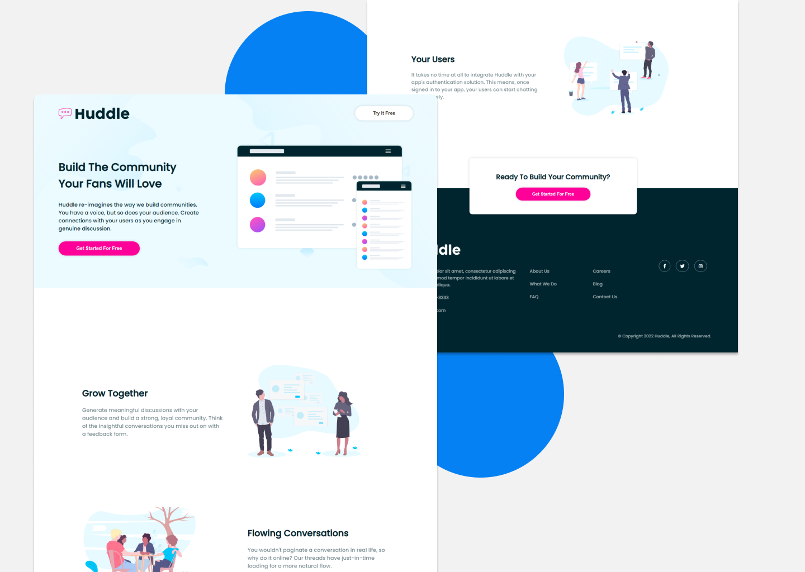

# Frontend Mentor - Huddle landing page with alternating feature blocks solution

This is a solution to the [Huddle landing page with alternating feature blocks challenge on Frontend Mentor](https://www.frontendmentor.io/challenges/huddle-landing-page-with-alternating-feature-blocks-5ca5f5981e82137ec91a5100). Frontend Mentor challenges help you improve your coding skills by building realistic projects. 

## Table of contents

- [Overview](#overview)
  - [Installation](#installation)
  - [The challenge](#the-challenge)
  - [Screenshot](#screenshot)
  - [Links](#links)
- [My process](#my-process)
  - [Built with](#built-with)
  - [What I learned](#what-i-learned)
  - [Continued development](#continued-development)
  - [Useful resources](#useful-resources)
- [Author](#author)


## Overview

### Installation

Install dependencies
```
npm install
```

Running
```
npm start
```

### The challenge

Users should be able to:

- View the optimal layout for the site depending on their device's screen size
- See hover states for all interactive elements on the page

### Screenshot



### Links

- Solution URL: [Github](https://github.com/farhannhdyt/huddle)
- Demo URL: [huddle-demo](https://huddle-demo.vercel.app/)

## My process

### Built with

- Semantic HTML5 markup
- Flexbox
- CSS Grid
- Mobile Responsive
- [React](https://reactjs.org/) - JS library
- [Styled Components](https://styled-components.com/) - For styles


### What I learned

in this project, I use react js and styled components as a medium to design components easily and quickly.

Here an example of styled-components syntax 👇

```html
<h1>Example Heading</h1>
```
```js
// import styled from 'styled-component
export const Heading = styled.h1`
  font-size: 20px;
  color: blue;
`
```

```js
// import { Heading } from 'styled.js'
<Heading>Example Component</Heading>
```

From the example above, we used the styled-component to change the size and color of the h1. By using styled-component it will be easier to design the component and maintain it.


### Useful resources

- [React JS](https://reactjs.org/) - This helped me for building user-interface in an easy way. I really liked this library and will use it going forward.
- [Styled Components](https://styled-components.com/) - Styled Components is a tools that helped me to styling components with actuall CSS code in JavaScript. I'd recommend it to anyone who want to styling a component in React with this tool.

## Author

- Website - [Farhan Nur Hidayat (Github)](https://github.com/farhannhdyt)
- Frontend Mentor - [@farhannhdyt](https://www.frontendmentor.io/profile/farhannhdyt)
- Instagram - [@farhaanhdytt](https://www.instagram.com/farhaanhdytt)
